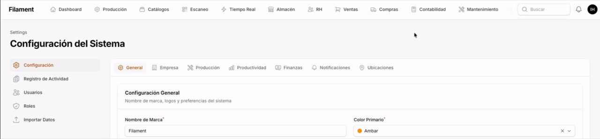

# Filament Scrollable Top Navigation

[](https://packagist.org/packages/emuniq/filament-scrollable-topnav)
[](https://packagist.org/packages/emuniq/filament-scrollable-topnav)
[](LICENSE)

A Filament v3 & v4 plugin that turns the top navigation into a single scrollable row instead of letting it wrap into multiple rows when you have many navigation groups or clusters. Adds horizontal mouse-wheel scrolling and an edge-fade affordance so users can tell there's more to see.

## Demo



## The Problem

Filament's `topNavigation()` wraps clusters into two (or more) rows when they don't fit, eating vertical space and looking cluttered. Two-word labels can also break across lines. With a lot of clusters there's no visual hint that more navigation exists off-screen, and a regular mouse wheel can't scroll it.

## The Solution

- Forces the topnav into a single row with a hidden scrollbar.
- Mouse-wheel scrolling: vertical wheel ticks scroll the topnav horizontally.
- Edge fade affordance: a soft gradient appears on the leading/trailing edges only when there's more content in that direction, so users instinctively scroll.
- Optional scroll-snap so swipes/wheel land on cluster boundaries.
- Auto-scrolls focused items into view for keyboard navigation.

## Requirements

- PHP 8.1+
- Laravel 10, 11, or 12
- Filament 3.0+ or 4.0+

## Installation

```bash
composer require emuniq/filament-scrollable-topnav
```

Register the plugin in your panel provider:

```php
use Emuniq\FilamentScrollableTopnav\ScrollableTopnavPlugin;

public function panel(Panel $panel): Panel
{
    return $panel
        ->topNavigation()
        ->plugins([
            ScrollableTopnavPlugin::make(),
        ]);
}
```

That's it. The plugin ships its own CSS and JS as Filament assets and injects a small inline `<style>` + config block via the `HEAD_END` render hook to prevent the brief double-row flash before the asset CSS loads.

### Optional: bundle into a custom theme

If you have a custom Filament theme and want the styles compiled into your theme bundle (zero FOUC, fully cacheable), import the plugin CSS:

```bash
php artisan scrollable-topnav:install
npm run build
```

Or manually add to `resources/css/filament/{panel}/theme.css`:

```css
@import '../../../../vendor/emuniq/filament-scrollable-topnav/resources/css/plugin.css';
```

## Configuration

Every behavior is opt-in/out via builder methods on `ScrollableTopnavPlugin::make()`:

| Method                       | Default  | What it does                                                                       |
|------------------------------|----------|------------------------------------------------------------------------------------|
| `->fadeSize(string $size)`   | `'36px'` | Width of the edge fade gradient. Any CSS length.                                   |
| `->edgeHints(bool)`          | `true`   | Show the fade gradient when there's overflow in that direction.                    |
| `->wheelToScroll(bool)`      | `true`   | Translate vertical mouse-wheel deltas into horizontal scroll on the topnav.        |
| `->autoScrollToFocus(bool)`  | `true`   | Scroll a focused (`:focus`) cluster into view — keyboard accessibility.            |
| `->scrollSnap(bool)`         | `false`  | Snap scroll position to cluster boundaries (`scroll-snap-type: x proximity`).      |

Example with everything tuned:

```php
ScrollableTopnavPlugin::make()
    ->fadeSize('48px')
    ->scrollSnap()
    ->wheelToScroll(false), // disable on a panel that already uses wheel for something else
```

## How It Works

1. **Critical inline CSS** via the `HEAD_END` render hook applies `flex-wrap: nowrap` and `white-space: nowrap` immediately on parse, preventing FOUC.
2. **Filament asset CSS** (`plugin.css`) provides the full styling: hidden scrollbar, mask-image edge fades, scroll-snap rules — all gated by `data-*` attributes that the JS toggles.
3. **Filament asset JS** (`plugin.js`) listens for `wheel`, `scroll`, `focusin`, and `resize` events on `.fi-topbar-nav-groups`. It detects mouse wheels (which only emit `deltaY`) and converts them to horizontal scroll while preserving native trackpad horizontal swipes (`deltaX`). It also normalizes `WheelEvent.deltaMode` so high-resolution and line-step wheels both feel right.
4. **Config injection** — the inline `<script>` sets `window.scrollableTopnavConfig` *before* the deferred plugin JS runs, so each panel can have its own settings.

## Compatibility Notes

- The 1024px breakpoint matches Filament's `lg`, where `topNavigation()` becomes a row instead of a sidebar. Below it the plugin is a no-op.
- `mask-image` is supported in all evergreen browsers. IE11 isn't supported (Filament 4 doesn't support it either).
- Livewire navigation is handled — the plugin re-binds on `livewire:navigated`.

## License

MIT
